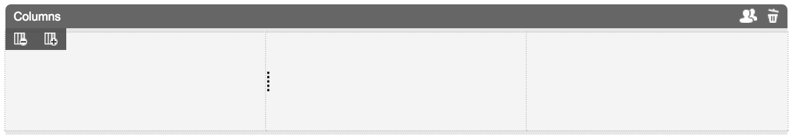
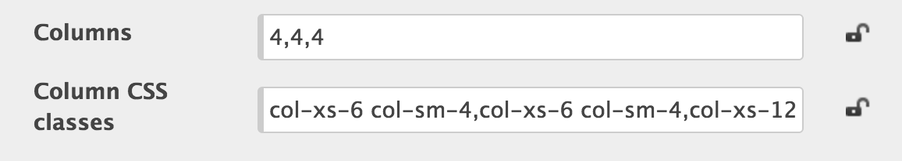

# ColumnContainer
Simple column container

## Information
|  name |  version |  bundle |
|--|:--:|--:|
|  container-column |  2.2.0 |  Universal |

## Dependencies

- template-column ^3.1.0

## Product Description
Column container was built to bring grid functionality which is common to many CSS frameworks like Twitter Bootstrap.

## Functional Overview
Default grid system has 12 columns. Grid root element is Page Container, which has container class. Grid size is 940px or 12 columns, each span is 60px width with 20px margin. Columns have classes in `col-sm-X` format (where X is one of 1 to 12).

## Screenshots
CXP Manager screenshot

## Features

- Responsive

## Preferences
Container has 5 custom properties: columns (for storing column sizes), columnsCSSClasses, gridSize, gutterWidth, spanWidth (for storing grid parameters mentioned above).

Only the first two preferences are rendered on preference panel.

### columns and columnsCSSClasses
Column sizes and classes are configured with either drag and resize UI controls or by changing corresponding values on the preferences form. Preferences typically look like on below screenshot:

Above configuration defines:

- 3 columns, each spaning 4 grid columns
- The first and the second columns will be rendered with `col-xs-6 col-sm-4` classes
- Last column will have `col-xs-12 col-sm-4` classes.

It means that on small-wide resolutions (col-sm-x) all columns will take equal space (one third, 12/4). On the extra-small screens first two columns will take 50% (6+6) of the row and the third columns will create a new row with 100% width (12).

